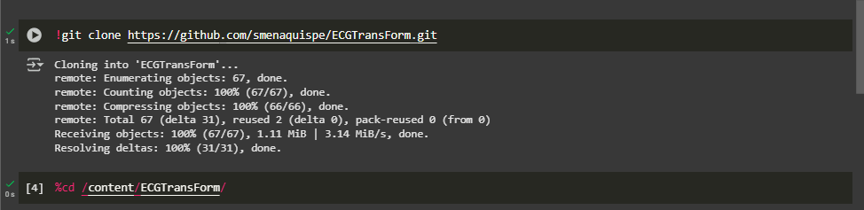
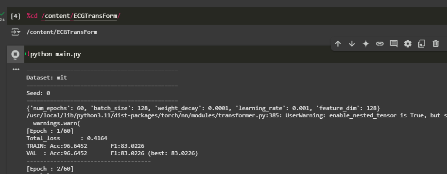
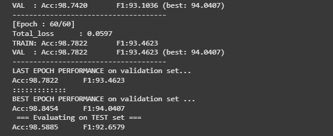

---

# ECGTransForm: Empowering Adaptive ECG Arrhythmia Classification Framework with Bidirectional Transformer \[[Paper](https://www.sciencedirect.com/science/article/pii/S1746809423011473)] \[[Cite](#citation)]

#### *by: Hany El-Ghaish, Emadeldeen Eldele*

#### This work is accepted for publication in the Biomedical Signal Processing and Control.

---

## ⚠️ Fork Notice

Este repositorio es un *fork* del proyecto original propuesto en el artículo mencionado arriba.
Modificado y ejecutado por **Sergio Sebastian S. Mena Quispe**, alumno de la carrera de **Ciencia de la Computación** en la **Universidad Nacional de San Agustín de Arequipa (UNSA)**.

Este trabajo hace uso del dataset **MIT-BIH Arrhythmia Database** para realizar pruebas del modelo.

🔗 Puedes revisar la ejecución de este proyecto en Google Colab en el siguiente enlace:
**[Colab Link](https://colab.research.google.com/drive/1ZaUJ1D5DxTEj_tMKqrW8PFWOZdBnBI9u?usp=sharing)**


A partir de este proyecto iniciaré con mi investigación para la reducción de la dimensionalidad

---

## About


Our proposed model, ECGTransForm, is a deep learning framework for ECG arrhythmia classification, featuring a novel Bidirectional Transformer mechanism and Multi-scale Convolutions for effective spatial and temporal feature extraction. The framework also includes a Context-Aware Loss to handle the class imbalance in ECG data, demonstrating superior performance in arrhythmia diagnosis.

---

## Datasets

We used two public datasets in this study (Download our preprocessed version of the datasets from [Google Drive](https://drive.google.com/drive/folders/1hnzoYfipi9xqDJfc2R0hfLAcon6k71XZ)):

* [MIT-BIH](https://www.physionet.org/content/mitdb/1.0.0/)
* [PTB](https://physionet.org/content/ptbdb/1.0.0/)

---

## Configurations

There are two configuration files:

* one for dataset configuration: `configs/data_configs.py`
* one for training configuration: `configs/hparams.py`

---

## Results

<p align="center">

</p>

---

## 🔍 Ejecución Personal

Esta sección muestra capturas de pantalla y resultados obtenidos durante la ejecución del modelo en Colab con el dataset **MIT-BIH**:



Hice la clonación del proyecto. Luego agregue 


Y luego le di inicio al script de entrenamiento


Tras 60 épocas se logró una precisión del 98%


Con una ejecicón 1 hora y 33 minutos para 60 épocas en el entorno de colab

---

## Citation:

If you found this work useful for you, please consider citing it.

```
@ARTICLE{ecgTransForm,
    title = {ECGTransForm: Empowering adaptive ECG arrhythmia classification framework with bidirectional transformer},
    journal = {Biomedical Signal Processing and Control},
    volume = {89},
    pages = {105714},
    year = {2024},
    issn = {1746-8094},
    doi = {https://doi.org/10.1016/j.bspc.2023.105714}, 
    url = {https://www.sciencedirect.com/science/article/pii/S1746809423011473},
    author = {Hany El-Ghaish and Emadeldeen Eldele},
}
```

---

¿Quieres que te ayude a incrustar directamente las imágenes o subir el archivo a Colab con el enlace listo?
